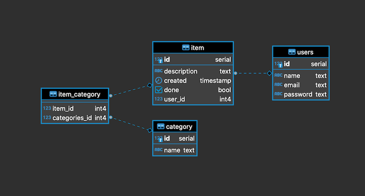
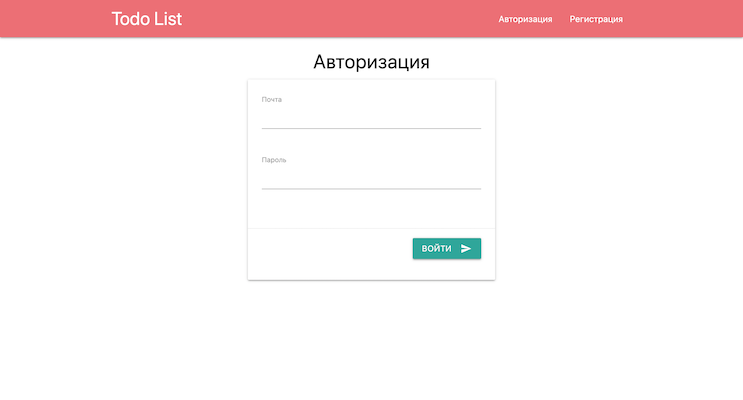
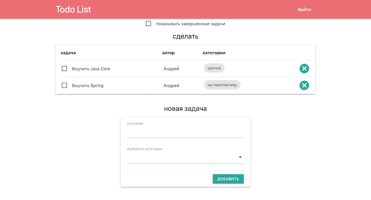
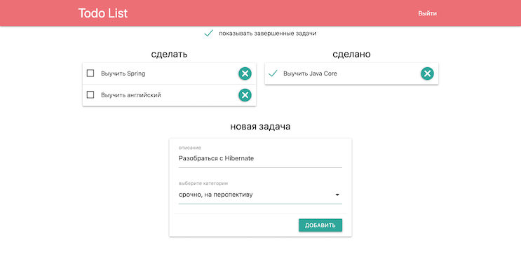
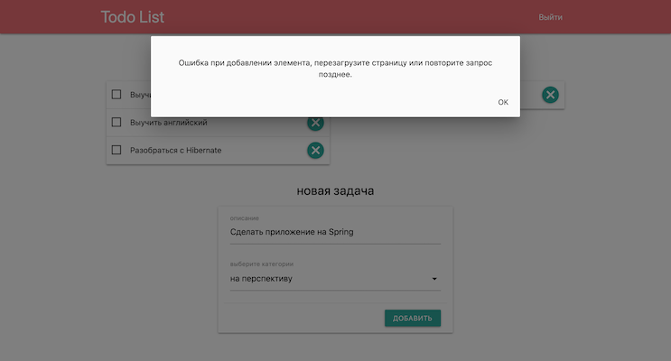

# todo list
[](https://travis-ci.org/ReyBos/job4j_todo) &nbsp;&nbsp;
[](https://codecov.io/gh/ReyBos/job4j_todo)

<a name="menu"></a>
<ul>
    <li>
        <a href="#about">О проекте</a>
        <ul>
            <li><a href="#description">Описание</a></li>
            <li><a href="#technologies">Технологии</a></li>
            <li><a href="#structure">Структура</a></li>
            <li><a href="#scheme">Схема БД</a></li>
        </ul>
    </li>
    <li>
        <a href="#build">Сборка</a>
    </li>
    <li>
        <a href="#intarface">Пользовательский интерфейс</a>
        <ul>
            <li><a href="#auth_page">Регистрация/авторизация</a></li>
            <li><a href="#main_page">Главная</a></li>
            <li><a href="#item_status">Изменение статуса задачи</a></li>
            <li><a href="#item_notification">Оповещения об ошибках</a></li>
        </ul>
    </li>
    <li>
        <a href="#links">Полезные ссылки</a>
    </li>
    <li>
        <a href="#contact">Контакты</a>
    </li>
</ul>

<h2><a name="about">О проекте</a>&nbsp;&nbsp;<a href="#menu">&#9650;</a></h2>
<h4><a name="description">Описание</a>&nbsp;&nbsp;<a href="#menu">&#9650;</a></h4>
<p>
    Проект для изучения Java EE.
</p>
<p>
    Это приложение - список дел. У пользователя есть возможность добавлять задачи в свой список дел. Завершенную задачу можно отметить как выполненную
    и она пропадет из списка к выполнению. Для удобства пользователя есть возможность отобразить завершенные задачи, вернуть задачу в список активных задач,
    а также удалить не нужные.
</p>

<h4><a name="technologies">Технологии</a>&nbsp;&nbsp;<a href="#menu">&#9650;</a></h4>
<ul>
    <li>Java 14</li>
    <li>Java EE Servlets</li>
    <li>PostgreSQL, Hibernate, Liquibase</li>
    <li>JUnit, Mockito, PowerMock</li>
    <li>Maven, Tomcat</li>
    <li>HTML, JavaScript, jQuery, JSON</li>
    <li><a href="https://materializecss.com">Material Design library</a></li>
</ul>

<h4><a name="structure">Структура</a>&nbsp;&nbsp;<a href="#menu">&#9650;</a></h4>
<pre><code>.
|-db
|---scripts
|-images
|-src
|---main
|-----java
|-------ru
|---------reybos
|-----------model
|-----------service
|-----------servlet
|-----------store
|-----resources
|-----webapp
|-------WEB-INF
|-------css
|-------js
|-------template
|---test
|-----java
|-------ru
|---------reybos
|-----------servlet
|-----------store
└-----resources

</code></pre>

<h4><a name="scheme">Схема БД</a>&nbsp;&nbsp;<a href="#menu">&#9650;</a></h4>
<p align="center">
  
</p>

<h2><a name="build">Сборка</a>&nbsp;&nbsp;<a href="#menu">&#9650;</a></h2>
<ol>
    <li>
        Для успешной сборки и работы проекта на вашем компьютере должны быть установлены:
        <ol>
            <li>JDK 14(+)</li>
            <li>Maven</li>
            <li>PostgreSQL</li>
            <li>Tomcat</li>
        </ol>
    </li>
    <li>
        В PostgreSQL создайте базу с именем "job4j_todo"
    </li>
    <li>
        Скачайте проект к себе на компьютер с помощью команды<br>
        <code>git clone https://github.com/ReyBos/job4j_todo.git</code><br>
        перейдите в корень проекта
    </li>
    <li>
        Добавьте настройки для доступа к базе данных, для этого внесите соответствующие изменения в файле 
        <code>src/main/resources/hibernate.cfg.xml</code><br>
        и в файле конфигурации проекта <code>pom.xml</code>
    
``` 
<profile>   
    <id>production</id>
    <properties>
        <db.url>jdbc:postgresql://127.0.0.1:5432/job4j_todo</db.url>
        <db.username>postgres</db.username>
        <db.password>password</db.password>
        <db.driver>org.postgresql.Driver</db.driver>
    </properties>
</profile>
```
</li>
    <li>
        Выполните команду <code>mvn install -Pproduction</code> в корне проекта для его сборки<br>
        Будет выполнена миграция БД с помощью Liquibase.<br>
        В случае успешной сборки появится файл <code>target/todo-&#60;version&#62;.war</code><br>
        переименуйте его в <code>todo.war</code>
    </li>
    <li>
        Для запуска веб-приложения вам нужно скопировать <code>todo.war</code> в папку <code>webapps</code> вашего Tomcat
    </li>
    <li>
        После запуска сервера приложение будет доступно по адресу<br>
        <a href="http://localhost:8080/todo/">http://localhost:8080/todo/</a>
    </li>
</ol>

<h2><a name="intarface">Пользовательский интерфейс</a>&nbsp;&nbsp;<a href="#menu">&#9650;</a></h2>
<h3><a name="auth_page">Регистрация/авторизация</a>&nbsp;&nbsp;<a href="#menu">&#9650;</a></h3>
<p>
    Основной функционал приложения доступен только авторизованным пользователям. Это достигается за 
    счет фильтрации всех запросов и перенаправлении пользователей, при необходимости, на страницу 
    авторизации.
</p>
<p align="center">
  
</p>

<h3><a name="main_page">Главная</a>&nbsp;&nbsp;<a href="#menu">&#9650;</a></h3>
<p>
    Весь функционал приложения собран на главной странице. Здесь собрана информация о предстояющих и завершенных задачах.
    Добавление/изменение/удаление пунктов в списке происходит здесь же. Есть два режима отображения. В первом показываются 
    только заплонированные задачи, во втором запланированные и завершенные. 
</p>
<p align="center">
  
</p>

<h3><a name="item_status">Изменение статуса задачи</a>&nbsp;&nbsp;<a href="#menu">&#9650;</a></h3>
<p>
    Если задача выполнена, ее можно отметить как завершенную и тогда она пропадет из основного списка. Завершенную
    задачу можно вернуть в основной писок поменяв ее статус. 
</p>
<p align="center">
  
</p>

<h3><a name="item_notification">Оповещения об ошибках</a>&nbsp;&nbsp;<a href="#menu">&#9650;</a></h3>
<p>
    В системе предусмотрена система оповещения пользователей об ошибках с помощью модальных окон. 
    В случае не правильной работы приложения или некорректно введенных пользователем данных, он будет извещен об этом.
</p>
<p align="center">
  
</p> 

<h2><a name="links">Полезные ссылки</a>&nbsp;&nbsp;<a href="#menu">&#9650;</a></h2>
<p>Ресурсы которые были полезны при создании проекта</p>
<ul>
    <li>
        <strong><a href="http://akorsa.ru/2016/10/kak-logirovat-hibernate-ispolzuem-pravilnuyu-konfiguratsiyu/">link</a></strong>
        - настройка логирования Hibernate
    </li>
    <li>
        <strong><a href="https://coderoad.ru/6724401/%D0%9A%D0%B0%D0%BA-%D0%BD%D0%B0%D0%BF%D0%B8%D1%81%D0%B0%D1%82%D1%8C-junit-%D1%82%D0%B5%D1%81%D1%82%D0%BE%D0%B2-%D0%B4%D0%BB%D1%8F-%D0%B8%D0%BD%D1%82%D0%B5%D1%80%D1%84%D0%B5%D0%B9%D1%81%D0%BE%D0%B2">link</a></strong>
        - как написать тест на junit4 для интерфейса
    </li>
    <!--<li>
        <strong><a href="">link</a></strong>
        - настройка логирования Hibernate
    </li>-->
</ul>

<h2><a name="contact">Контакты</a>&nbsp;&nbsp;<a href="#menu">&#9650;</a></h2>
<p>Связаться со мной по всем интересующим вопросам вы можете здесь:</p>

[](https://www.linkedin.com/in/reybos/)&nbsp;&nbsp;
[](https://vk.com/reybos)&nbsp;&nbsp;
[](https://www.instagram.com/andreybossiy)&nbsp;&nbsp;
[](https://t.me/reybos)&nbsp;&nbsp;
[](mailto:andreybosiy@yandex.ru)&nbsp;&nbsp;
